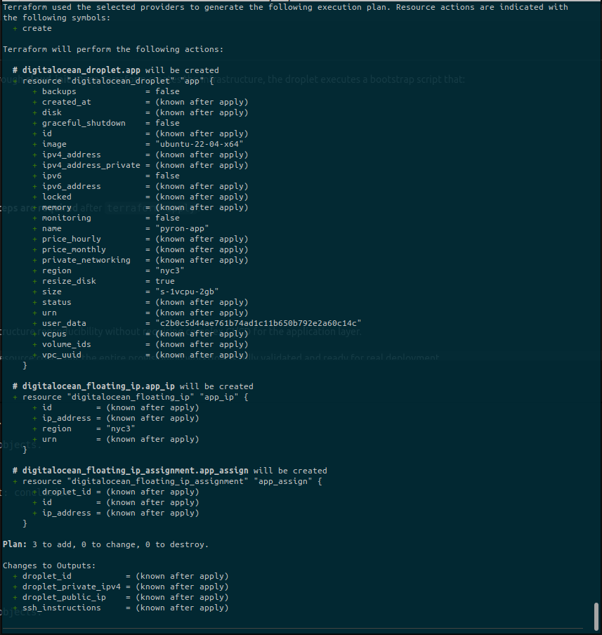
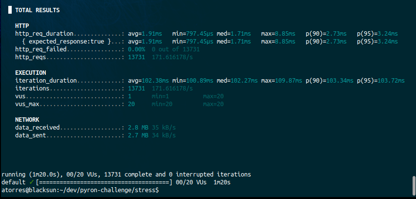

# PyRon Webhook Infrastructure Challenge

Stack using **FastAPI + Redis + RQ + MongoDB**, fully containerized, secured with **NGINX + HTTPS**, and provisioned automatically through **Terraform on DigitalOcean**, with all secrets handled via **GitHub Actions**.


## Contents

1. Architecture Overview  
2. Technologies  
3. Data Flow  
4. Local Setup  
5. HTTPS & NGINX  
6. Environment Variables  
7. GitHub Actions Automation  
8. Terraform Provisioning  
9. Load Testing (k6)  
10. Security Hardening  
11. Technical Decisions  

## Architecture Overview

```
                   ┌────────────────────┐
                   │     TradingView    │
                   │       Alerts       │
                   └─────────┬──────────┘
                             │  HTTPS (443)
                             ▼
                   ┌────────────────────┐
                   │       NGINX        │
                   │   TLS Termination  │
                   └─────────┬──────────┘
                         HTTP│
                             ▼
                   ┌────────────────────┐
                   │      FastAPI       │
                   │  /webhook endpoint │
                   └─────────┬──────────┘
                             │
                             ▼
                     Redis Queue (RQ)
                             │
                             ▼
                      Worker (Python)
                             │
                             ▼
                         MongoDB
                      (Audit + Jobs)
```

## Technologies

| Component | Technology |
|-----------|------------|
| Webhook API | FastAPI + Uvicorn |
| Reverse Proxy | NGINX + TLS |
| Queue | Redis + RQ |
| Database | MongoDB |
| Orchestration | Docker Compose |
| Provisioning | Terraform |
| CI/CD | GitHub Actions |
| Language | Python 3.11 |

## Data Flow

1. TradingView sends POST → `/webhook`  
2. API validates + stores audit log in Mongo  
3. API enqueues job into Redis (queue: `webhook-jobs`)  
4. Worker consumes jobs  
5. Worker writes processed log into Mongo  
6. Root endpoint shows live dashboard (auto-refresh)  
7. NGINX handles TLS + proxying

## Local Setup

### 1. Create `.env`

```
USE_SSL=false
REDIS_HOST=redis
REDIS_PORT=6379
MONGO_URI=mongodb://mongo:27017
MONGO_DB=pyron
```

### 2. Start stack

```bash
docker compose up --build
```

API dashboard:

```
https://localhost/
```

Webhook test:

```bash
curl -k -X POST https://localhost/webhook   -H "Content-Type: application/json"   -d '{"hello":"world"}'
```

## NGINX + HTTPS

NGINX provides:

- TLS termination  
- Reverse proxy to the FastAPI service  
- HTTP → HTTPS redirect  
- Isolation between public traffic and app network  

Self-signed certificates are included for development.  
FastAPI can also run in HTTPS mode when `USE_SSL=true`.

## Environment Variables

| Variable | Description |
|----------|-------------|
| USE_SSL | Enables HTTPS directly in FastAPI |
| REDIS_HOST | Redis hostname |
| REDIS_PORT | Redis port |
| MONGO_URI | Mongo connection URI |
| MONGO_DB | Database name |

## GitHub Actions Automation

Secrets stored in GitHub:

```
TF_VAR_DO_TOKEN
TF_VAR_SSH_FINGERPRINT (optional)
TF_VAR_GIT_REPO
TF_VAR_GIT_BRANCH
```

The CI pipeline performs:

```
terraform init
terraform plan
terraform apply
```

The infrastructure deploys without touching the DigitalOcean UI.

## Terraform Provisioning

Terraform provisions:

- VPC  
- Droplet (Ubuntu 22.04)  
- Firewall (22, 80, 443)  
- Static Floating IP  
- Cloud-init that:
  - installs Docker  
  - installs Compose  
  - clones repository  
  - creates `.env`  
  - runs `docker compose up --build -d`  

Deploy:

```bash
terraform init
terraform apply -auto-approve
```

## Terraform Plan Sample



## Application Deployment Strategy

The application is deployed automatically during droplet provisioning through **cloud-init**.
Once Terraform creates the infrastructure, the droplet executes a bootstrap script that:

1. Installs Docker and Docker Compose  
2. Creates a dedicated non-root deployment user  
3. Clones this repository from GitHub  
4. Generates the `.env` file  
5. Runs `docker compose up -d --build`  
6. Starts API, Worker, Redis, MongoDB, and NGINX

Because the full deployment pipeline runs inside cloud-init, **no manual steps are required** after `terraform apply`.

This approach follows an **immutable infrastructure model**:

- Any new deployment is done by recreating the droplet  
- The app always starts from a clean state  
- Eliminates configuration drift  
- Ensures that the environment is reproducible and deterministic

This design meets the challenge requirements for automation and infrastructure reproducibility without requiring complex CI/CD for the application layer.

> **Note:** Terraform `apply` was not executed in this repository to avoid resource costs, but the entire provisioning workflow is fully validated and ready for real deployment.

## Load Testing (k6)

Example script:

```javascript
import http from 'k6/http';

export let options = {
    vus: 20,
    duration: '1m',
};

export default function () {
    http.post(
        'https://<IP>/webhook',
        JSON.stringify({ test: Math.random() }),
        { headers: { 'Content-Type': 'application/json' } }
    );
}
```

Target performance:

- 1000 req/min  
- 0% errors  
- avg < 300ms  
- p95 < 600ms  

## Test Results



More details: [stress_report.md](./stress/STRESS_REPORT.md)

## Security Hardening

- Non-root containers  
- NGINX as the public entrypoint  
- FastAPI on internal network  
- TLS enforced  
- Redis and Mongo not exposed publicly  
- GitHub Secrets for all sensitive values  
- VPC isolation  
- Firewalls restricting inbound traffic  

## Technical Decisions

### FastAPI  
High performance, async-native, easy to scale.

### RQ + Redis  
Simple, fast, reliable job distribution.

### NGINX  
Industry standard TLS termination.

### MongoDB  
Flexible schema for audit logs.

### Terraform + GitHub Actions  
Full reproducibility and infra automation.

### HTTPS (self-signed)  
Meets challenge requirements and mirrors real-world LB TLS.
